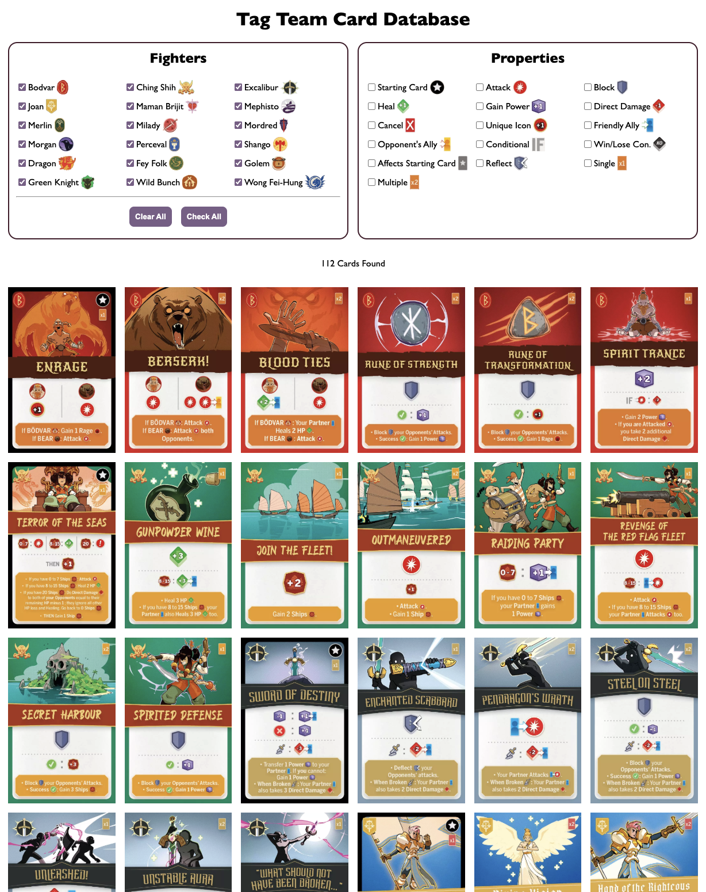
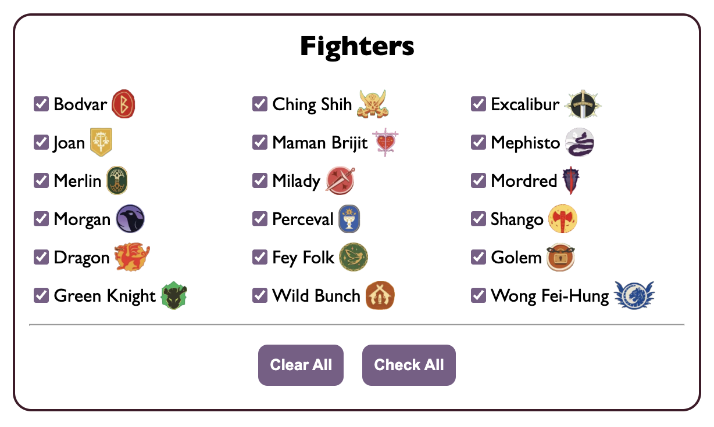
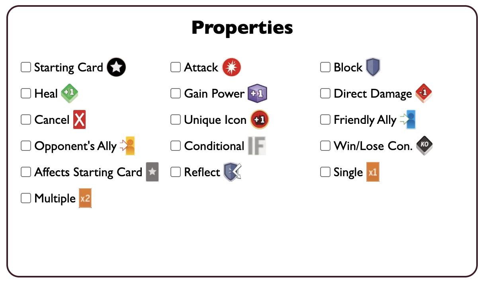
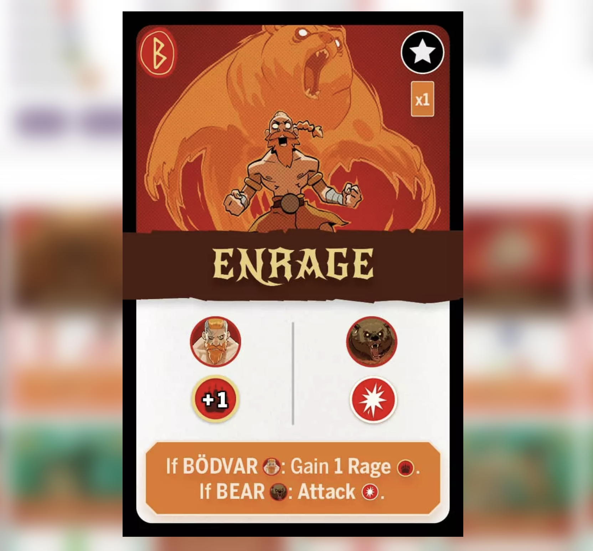
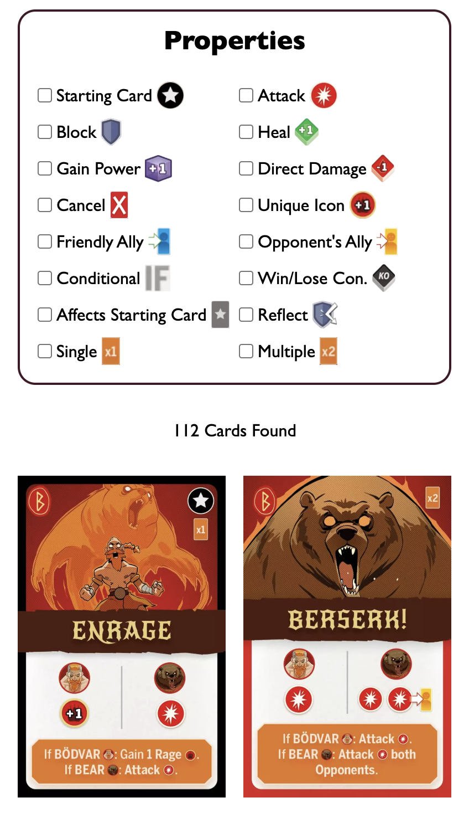

# Tag Team Card Database
A filterable online database for all cards in Tag Team.

## Overview
The purpose of this database is to let fans of the game view cards from all of the game's fighters. Users can also filter in various ways to see exactly the cards they want, or to discover how many of a certain type of card exists.

## Features

### Filter by Fighter
Users can filter which fighter's cards they want to see. By default, all 18 fighters are selected. Users can deselect any fighters whose cards they don't want to see. Alternatively, they can deselect all fighters, then choose the fighter or fighters whose cards they do wish to see.

### Filter by Properties
Users can filter which cards they want to see by a card's properties. This could be certain effects that a card activates (e.g., attack, block, heal), if the card is a starting card, if the card is a single copy or if there are multiple, etc.

### Image Enlargement
Clicking on any card will enlarge it to full screen, letting a user see the card art in its full glory.

### Responsive
This webpage functions and looks good on mobile devices, desktops, and everything in between.

### Site Link
https://ryanascherr.github.io/tag-team/

### Feedback, Suggestions, and Bugs
Have an idea to make this database better? Find a bug? Let me know at https://github.com/ryanascherr/tag-team or ryanascherr@gmail.com