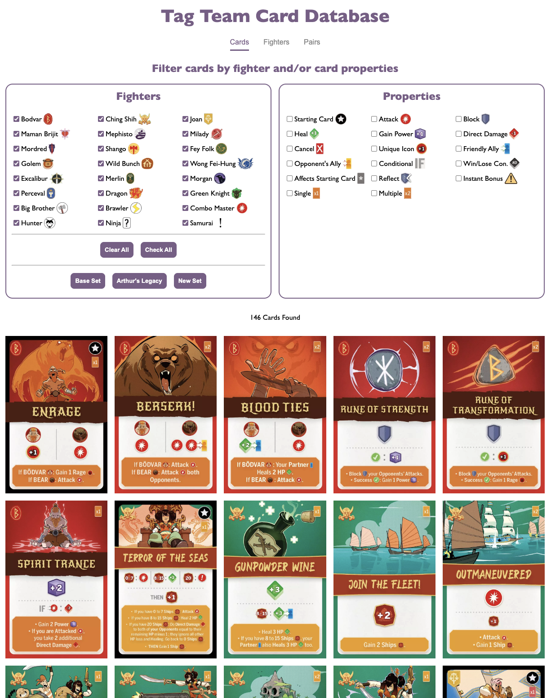
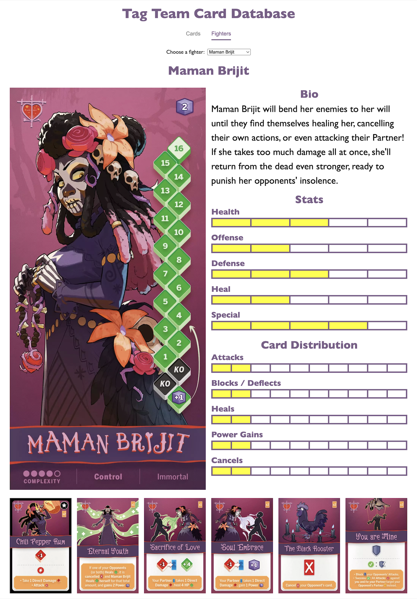

# Tag Team Card Database
A filterable online database for all cards in Tag Team.

## Overview
The purpose of this database is to let fans of Tag Team interact with the game's cards and fighters in fun, helpful, and interesting ways. Users can filter through all of the games cards, see data about each fighter, and make a team of fighters to see how well they work together.

## Features

### Cards Tab
. 

**Filter by Fighter**
Users can filter which fighter's cards they want to see. By default, all 24 fighters are selected. Users can deselect any fighters whose cards they don't want to see. Alternatively, they can deselect all fighters, then choose the fighter or fighters whose cards they do wish to see.

. 

**Filter by Properties**
Users can filter which cards they want to see by a card's properties. This could be certain effects that a card activates (e.g., attack, block, heal), if the card is a starting card, if the card is a single copy or if there are multiple, etc.

### Fighters Tab
. 

Choose any of the 24 fighters from the dropdown to see the following information:

**Fighter Boards:** View the fighter's fighter board. Fighters that have a double-sided board (i.e., Bodvar, Excalibur) or two boards (i.e., Merlin, Big Brother) will have both of their boards displayed.

**Bio:** For the 12 original fighters, their bio from the Fighter Profiles PDF is displayed.

**Stats:** For the 12 original fighters, their stats from the Fighter Profiles PDF is displayed.

**Card Distribution:** See the number of cards out of that fighter's 10-card deck are attacks, blocks, heals, power gains, and sometimes a card property that is unique to that fighter.

### Pairs Tab
. 

Users can either choose a pair of two fighters from a dropdown or randomize a pair of fighters. Either way, they'll see both of their fighter boards, some stats about their combined decks (e.g., how many attacks / % of attacks), as well as all 20 of their cards.

This can be helpful if you like randomizing a pair of fighters during a pick-and-choose draft, if you like theory-crafting a team of fighters, or if you'd like an easy reference for the cards in your team's deck or your opponent's deck.

### Image Enlargement
Clicking on any card will enlarge it to full screen, letting a user see the card art in its full glory.

### Responsive
This webpage functions and looks good on mobile devices, desktops, and everything in between.

### Site Link
https://ryanascherr.github.io/tag-team/

### Feedback, Suggestions, and Bugs
Have an idea to make this database better? Find a bug? Let me know at https://github.com/ryanascherr/tag-team or ryanascherr@gmail.com